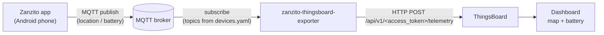

# zanzito-thingsboard-exporter

[](https://github.com/t0mer/zanzito-thingsboard-exporter/actions/workflows/docker-image.yml)
[](https://hub.docker.com/r/techblog/zanzito-thingsboard-exporter)
[](LICENSE)

zanzito-thingsboard-exporter is a small Python application that shares the location from the
Zanzito Android app with
[ThingsBoard](https://thingsboard.io/), so you can build a dashboard that displays the location
and battery status of the monitored device.

It subscribes to the MQTT topics Zanzito publishes to, and forwards each message to the
matching ThingsBoard device as telemetry, using the ThingsBoard HTTP device API.

> This project is not affiliated with, endorsed by, or supported by Zanzito or ThingsBoard.

## Table of contents

- [Features](#features)
- [How it works](#how-it-works)
- [Requirements](#requirements)
- [Zanzito setup](#zanzito-setup)
- [ThingsBoard setup](#thingsboard-setup)
- [Installation](#installation)
- [Configuration](#configuration)
- [Telemetry sent to ThingsBoard](#telemetry-sent-to-thingsboard)
- [Building a dashboard](#building-a-dashboard)
- [Troubleshooting](#troubleshooting)
- [Privacy](#privacy)
- [Security notes](#security-notes)
- [Development](#development)
- [Contributing](#contributing)
- [License](#license)

## Features

- Subscribes to one MQTT topic per configured device.
- Maps each topic to a ThingsBoard device by its access token (`devices.yaml`).
- Forwards the message payload unchanged to ThingsBoard as time-series telemetry
  (`POST <TB_SERVER_ADDRESS>/api/v1/<access_token>/telemetry`).
- Optional MQTT username/password authentication.
- Retries the broker connection with exponential backoff (1 s, doubling up to 60 s, 12 attempts in its own retry loop).
- Creates a template `devices.yaml` in the config directory on first run.
- Multi-arch Docker image (`linux/amd64`, `linux/arm64`, `linux/arm/v7`).

## How it works



1. On startup the exporter loads `config/devices.yaml`. If the file doesn't exist, it copies the
   bundled template there.
2. It connects to the MQTT broker and subscribes to the `topic` of every configured device.
3. When a message arrives, it looks up the device whose `topic` equals the message topic
   exactly, and posts the raw payload to ThingsBoard with that device's `access_token`.
4. Messages on topics that don't match any device are ignored.

## Requirements

- An MQTT broker reachable by both the phone running Zanzito and the exporter
  (for example Mosquitto).
- A ThingsBoard instance (self-hosted or cloud) reachable over HTTP(S) from the exporter.
- The Zanzito app on an Android device, configured to publish to your broker.
- Docker, or Python 3 with the packages in `requirements.txt` to run from source.
  The code uses the paho-mqtt 2.x client API (`CallbackAPIVersion`).

## Zanzito setup

In the Zanzito app, point the MQTT connection at the same broker the exporter uses: broker
host, port, and username/password if your broker requires them.

Zanzito publishes under a topic prefix and device name. According to the Zanzito User Manual
(v1.2), the relevant topics are:

| Topic | Content (per the Zanzito manual) |
|---|---|
| `zanzito/<device-name>/location` | JSON with `longitude`, `latitude`, `altitude`, `gps_accuracy`, `battery_level` and `tst` (timestamp). |
| `zanzito/<device-name>/battery_level` | The battery level, probably as a bare value rather than JSON. |

Because the location message already includes `battery_level`, forwarding the `location`
topic alone is enough for both the map and the battery status. Put that exact topic into
`devices.yaml`. Topics are matched exactly, so MQTT wildcards (`+`, `#`) do not work here.
<!-- TODO: verify the Zanzito topic names and payload fields against your Zanzito app version -->

To confirm what Zanzito publishes, watch the broker with any MQTT client, for example:

```bash
mosquitto_sub -h <broker-host> -p 1883 -u <user> -P <password> -t 'zanzito/#' -v
```

## ThingsBoard setup

1. In ThingsBoard, open **Entities → Devices** and add a new device (one per phone).
2. Open the device, go to the **Details** tab, and click **Copy access token**.
3. Put that token in the `access_token` field of the matching entry in `devices.yaml`.

The exporter uses the ThingsBoard HTTP device API, so no extra ThingsBoard configuration
(rule chains, integrations) is required. `TB_SERVER_ADDRESS` is the base URL you use to open the
ThingsBoard web UI, for example `http://192.168.1.10:8080` or `https://thingsboard.example.com`.

### Installing ThingsBoard using Docker (optional)

If you don't have ThingsBoard yet, you can run it in Docker. See the official
[ThingsBoard Docker installation guide](https://thingsboard.io/docs/user-guide/install/docker/)
for full, up-to-date instructions. A short summary:

ThingsBoard offers three single-instance Docker images:

- `thingsboard/tb-postgres`: single instance of ThingsBoard with a PostgreSQL database.
  - Recommended for small servers with at least 1 GB of RAM and minimal load.
  - 2–4 GB of RAM is recommended for optimal performance.
- `thingsboard/tb-cassandra`: single instance of ThingsBoard with a Cassandra database.
  - The most performant option, requiring at least 4 GB of RAM.
  - 8 GB of RAM is recommended for optimal performance.
- `thingsboard/tb`: single instance of ThingsBoard with an embedded HSQLDB database.
  - Not recommended for evaluation or production use; suitable only for development and testing.

This guide uses `thingsboard/tb-postgres`, but you can choose another image based on your
database requirements.

ThingsBoard also supports several queue services for messages between its components:

- **In memory**: built in and the default; suitable for development, not for production.
- **Kafka**: recommended for production deployments, providing scalability and reliability.
- **RabbitMQ**: suitable for low-load deployments if you already have RabbitMQ experience.
- **AWS SQS, Google Pub/Sub, Azure Service Bus**: fully managed cloud services.
- **Confluent Cloud**: a managed streaming platform based on Kafka.

Example `docker-compose.yml` for ThingsBoard:

```yaml
version: '3.0'
services:
  mytb:
    restart: always
    image: "thingsboard/tb-postgres"
    ports:
      - "8080:9090"
      - "1883:1883"
      - "7070:7070"
      - "5683-5688:5683-5688/udp"
    environment:
      TB_QUEUE_TYPE: in-memory
    volumes:
      - ~/.mytb-data:/data
      - ~/.mytb-logs:/var/log/thingsboard
```

- **Ports**: map host ports to ThingsBoard's internal ports (web UI on host port 8080).
  ThingsBoard's own MQTT port (1883) will clash with a separate MQTT broker on the same host;
  change or remove that mapping if needed.
- **Environment**: configures the queue service (in memory in this example).
- **Volumes**: host directories for data and logs.

Before starting the containers, create the data and log directories and adjust their
permissions as described in the ThingsBoard guide:

```bash
mkdir -p ~/.mytb-data ~/.mytb-logs
```

Then start ThingsBoard:

```bash
docker compose up -d
docker compose logs -f mytb
```

Replace `mytb` with your service name if it differs. ThingsBoard is then available at
`http://<your-host-ip>:8080`.

## Installation

### Docker Compose

Based on the repository's [`docker-compose.yaml`](docker-compose.yaml):

```yaml
services:
  zanzito-thingsboard-exporter:
    image: techblog/zanzito-thingsboard-exporter:latest
    container_name: zanzito-thingsboard-exporter
    restart: always
    environment:
      - TB_SERVER_ADDRESS=http://<thingsboard-host>:8080
      - MQTT_BROKER_ADDRESS=<broker-host>
      - MQTT_BROKER_PORT=1883
      - MQTT_BROKER_USER=<mqtt-user>
      - MQTT_BROKER_PASSWORD=<mqtt-password>
    volumes:
      - ./zanzito-thingsboard-exporter/config:/app/config
```

```bash
docker compose up -d
```

On first start the container writes a template `devices.yaml` into the mounted config
directory. Edit it (see [Configuration](#configuration)) and restart the container:

```bash
docker compose restart zanzito-thingsboard-exporter
```

### Docker run

```bash
docker run -d \
  --name zanzito-thingsboard-exporter \
  --restart always \
  -e TB_SERVER_ADDRESS=http://<thingsboard-host>:8080 \
  -e MQTT_BROKER_ADDRESS=<broker-host> \
  -e MQTT_BROKER_PORT=1883 \
  -e MQTT_BROKER_USER=<mqtt-user> \
  -e MQTT_BROKER_PASSWORD=<mqtt-password> \
  -v "$(pwd)/config:/app/config" \
  techblog/zanzito-thingsboard-exporter:latest
```

Published images on Docker Hub:
[`techblog/zanzito-thingsboard-exporter`](https://hub.docker.com/r/techblog/zanzito-thingsboard-exporter),
tags `latest` and `1.0.0`, for `linux/amd64`, `linux/arm64` and `linux/arm/v7`.

### From source

```bash
git clone https://github.com/t0mer/zanzito-thingsboard-exporter.git
cd zanzito-thingsboard-exporter
pip install -r requirements.txt

cd app
mkdir -p config
export TB_SERVER_ADDRESS=http://<thingsboard-host>:8080
export MQTT_BROKER_ADDRESS=<broker-host>
export MQTT_BROKER_PORT=1883
export MQTT_BROKER_USER=<mqtt-user>
export MQTT_BROKER_PASSWORD=<mqtt-password>
python app.py
```

Run it from the `app/` directory: the config path (`config/devices.yaml`) and the template
(`devices.yaml`) are resolved relative to the working directory, and the `config/` directory
must already exist.

## Configuration

### Environment variables

| Variable | Default | Required | Description |
|---|---|---|---|
| `TB_SERVER_ADDRESS` | none | yes | ThingsBoard base URL including the scheme and without a trailing slash, e.g. `http://192.168.1.10:8080` or `https://thingsboard.example.com`. |
| `MQTT_BROKER_ADDRESS` | none | yes | Hostname or IP address of the MQTT broker. |
| `MQTT_BROKER_PORT` | `1883` | no | MQTT broker port. |
| `MQTT_BROKER_USER` | none | no | MQTT username. Leave empty if the broker allows anonymous access. |
| `MQTT_BROKER_PASSWORD` | none | no | MQTT password. |

The Dockerfile also declares a `REPORT_INTERVAL` variable, but the application doesn't use it.

The MQTT client ID is generated on each start as `zanzito-exporter-<random 0-1000>`.

### Devices file (`config/devices.yaml`)

The devices file maps each Zanzito MQTT topic to a ThingsBoard device access token. In Docker
it lives at `/app/config/devices.yaml` (mount `/app/config` as a volume); from source it is
`app/config/devices.yaml`. It is created from a template on first run if missing.

| Key | Type | Description |
|---|---|---|
| `devices` | list | One entry per topic to forward. |
| `devices[].name` | string | Friendly name for the entry (informational only). |
| `devices[].topic` | string | Exact MQTT topic to subscribe to, e.g. `zanzito/<device-name>/location`. |
| `devices[].access_token` | string | Access token of the ThingsBoard device that receives the data. |

Example:

```yaml
devices:
  - name: My phone
    topic: zanzito/<device-name>/location
    access_token: <thingsboard-device-access-token>
```

You can forward more than one topic to the same ThingsBoard device by adding another entry
with the same `access_token` and a different `topic`, but only if that topic's payload is a
JSON object. Don't add the `battery_level` topic: its payload is likely a bare value, which
ThingsBoard's telemetry endpoint rejects. The battery level already arrives with the location
message.

The file is read only at startup, so restart the exporter after changing it.

## Telemetry sent to ThingsBoard

The exporter does not parse or rename anything: the MQTT payload is posted as-is, with
`Content-Type: application/json`, to:

```text
POST <TB_SERVER_ADDRESS>/api/v1/<access_token>/telemetry
```

This means:

- Data is stored as **time-series telemetry** (not attributes) on the ThingsBoard device.
- The telemetry keys are exactly the JSON keys in Zanzito's payload. For the `location` topic,
  the Zanzito manual lists `longitude`, `latitude`, `altitude`, `gps_accuracy`,
  `battery_level` and `tst` (see [Zanzito setup](#zanzito-setup)).
- The payload must be valid JSON that ThingsBoard accepts as telemetry; otherwise ThingsBoard
  rejects the request and the exporter prints `Failed to send data: ...` to stdout.

Check the device's **Latest telemetry** tab in ThingsBoard to see which keys arrive.

## Building a dashboard

- Create a dashboard and add a **Maps** widget (for example OpenStreetMap) with the device as
  the data source. Set the widget's latitude and longitude keys to `latitude` and
  `longitude` (or whatever you see in **Latest telemetry**).
- Add a card, gauge or battery widget bound to `battery_level`.
- Use a time-series or trip-animation widget if you want to see location history.

## Troubleshooting

- **`Connection refused – bad username or password` / `not authorised`**: check
  `MQTT_BROKER_USER` and `MQTT_BROKER_PASSWORD`, and the broker's ACLs for the Zanzito topics.
- **No data in ThingsBoard**:
  - Make sure the `topic` in `devices.yaml` matches the published topic exactly (case
    included); wildcards are not supported.
  - Make sure `TB_SERVER_ADDRESS` includes `http://` or `https://` and has no trailing slash.
  - A wrong access token or a rejected payload results in `Failed to send data: ...`. This
    message is written with `print()`, not the logger, and the image doesn't set
    `PYTHONUNBUFFERED`, so under Docker it can show up late or not at all. Run the container
    with `-t` (`tty: true` in compose) or set `PYTHONUNBUFFERED=1` to see it immediately.
- **The container restarts in a loop after the first start**: the template `devices.yaml`
  has empty values, so `topic` is `None` and subscribing fails with
  `ValueError: No topic specified, or incorrect topic type.` The error is not caught, so the
  process exits, and with `restart: always` the container keeps restarting. Fill in the file
  and restart the exporter.
- **`No such file or directory` for `config/devices.yaml` when running from source**: run from
  the `app/` directory and create the `config/` directory first.
- **Data stops after a broker restart**: subscriptions are made once at startup. Restart the
  exporter if data stops arriving after the broker reconnects.
- **Reconnect log lines show `%s` or `%d` literally**: the reconnect messages use `%`-style
  placeholders, but the logger (loguru) uses `{}` formatting, so the values are not filled
  in. Also, `Reconnect failed after %s attempts. Exiting...` does not stop the process; the
  MQTT client keeps trying to reconnect.

## Privacy

This tool forwards the location of a phone, and therefore of a person. Location data is
sensitive personal data:

- Use it only for devices you own, or with the informed consent of the person being tracked.
- Restrict who can access the MQTT broker, the ThingsBoard instance and its dashboards.
- Consider how long ThingsBoard keeps telemetry history, and delete data you no longer need.

## Security notes

- The exporter connects to MQTT without TLS. Keep the broker on a trusted network or VPN,
  enable authentication, and restrict the Zanzito topics with ACLs.
- Use `https://` for `TB_SERVER_ADDRESS` when ThingsBoard is reachable over an untrusted network.
- ThingsBoard access tokens let anyone write data to the device. Protect `devices.yaml`, never
  commit it with real tokens, and rotate a token in ThingsBoard if it leaks.
- Pass MQTT credentials through environment variables or a secrets mechanism, not in files you
  share.

## Development

Project layout:

```text
app/
  app.py          # entry point: loads devices, MQTT client, forwards to ThingsBoard
  device.py       # Device model (name, topic, access token)
  devices.yaml    # devices file template, copied to config/ on first run
  defauly.py      # standalone test script (prints a counter); not used by the app
Dockerfile        # python:3.14-rc-slim-bookworm based image
docker-compose.yaml
requirements.txt
VERSION           # image version used by the Docker Hub workflow
```

Build the image locally:

```bash
docker build -t zanzito-thingsboard-exporter .
```

CI workflows (`.github/workflows/`):

| Workflow | Trigger | Publishes |
|---|---|---|
| `docker-image.yml` (Docker Build) | Manual, or after a workflow named `Create Release` completes | `techblog/zanzito-thingsboard-exporter:latest` and `:<VERSION>` to Docker Hub, for `linux/amd64`, `linux/arm64`, `linux/arm/v7` |
| `publish-ghcr.yml` (Publish to GHCR) | Manual, with an optional `tag` input (default `latest`) | `ghcr.io/t0mer/zanzito-thingsboard-exporter:<tag>` and `:latest`, same platforms |

There are no tests in the repository.

## Contributing

Issues and pull requests are welcome. Please keep changes focused, and describe how you
tested them against a real broker and ThingsBoard instance.

## License

This project is licensed under the Apache License 2.0. See [LICENSE](LICENSE).
